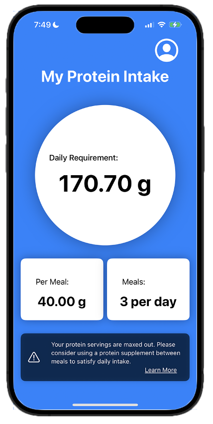

# My Protein Intake (iOS App)

## Description

This machine learning as a service iOS application calculate the optimal amount of protein you should consume on a daily basis. Just enable sharing Apple Health data, fill out a brief user profile, and get started with My Protein Intake. 



## Table of Contents (Optional)

- [Installation](#installation)
- [Usage](#usage)
- [License](#license)
- [Contribute](#contribute)
- [Tests](#tests)
- [Contact](#contact)

## Installation

```
This app is development only, as such, you will need XCode to open the app. 

You can run a direct simulation on your Mac, or if you have an Apple Developer account with a registered iPhone device, you can enable XCode to install the developmental version of the app on your phone. 

Note: Developer mode is required.
```

## Usage

Please refer to Apple's documentation for additional instructions. https://developer.apple.com/documentation/xcode/running-your-app-in-simulator-or-on-a-device

## License


## Contribute

If interested in contributing to this project, please email me at ediaz@smu.edu.

## Contact

Github: eddie-diaz-ms
Email: ediaz@smu.edu
